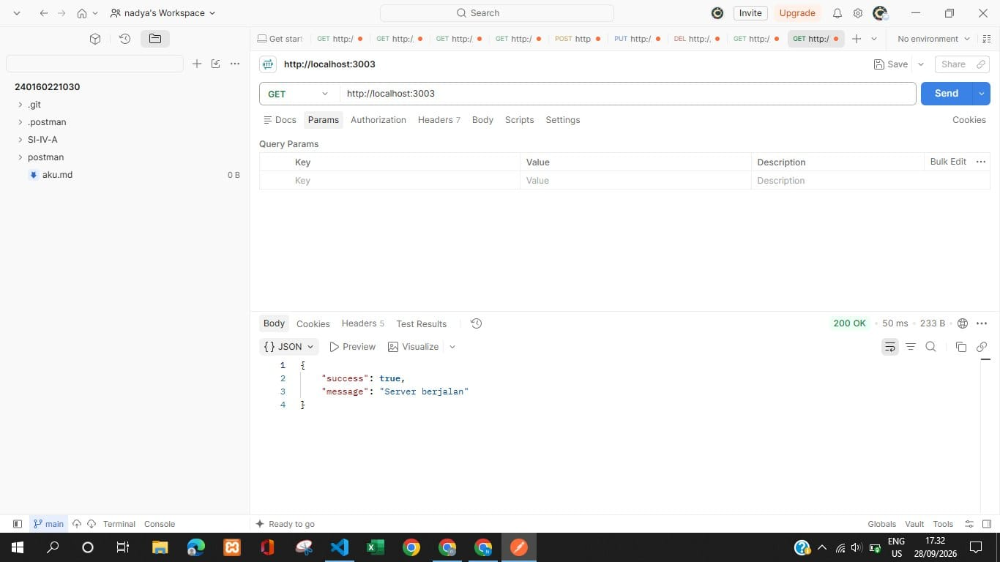
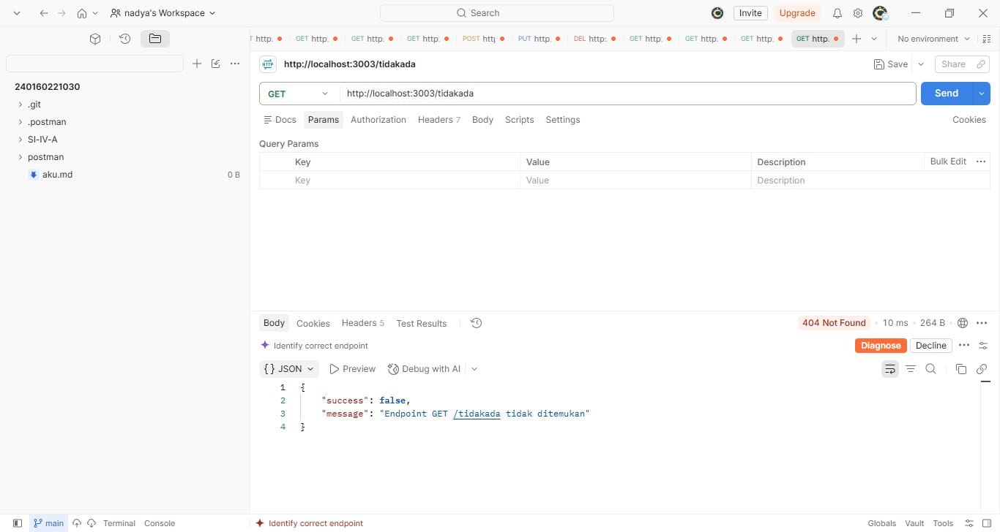
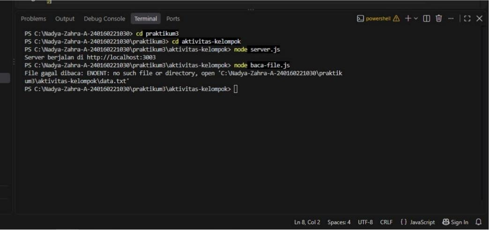

# Aktivitas Kelompok Pertemuan 3

## Anggota Kelompok 1
1. Della Kartika
2. Nadya Zahra Aulia
3. Rico Muhammad F
4. Nabila Ratasya Putri

--

## Aktivitas 1 — Analisis Runtime

Pada aktivitas pertama, kelompok melakukan analisis terhadap perbedaan runtime Browser dan Node.js. Tujuan dari aktivitas ini adalah memahami API yang tersedia pada masing-masing lingkungan serta mengetahui perbedaan penggunaan JavaScript pada Browser dan Node.js.

## Hasil Analisis

| API/Fitur| Runtime | Keterangan | 
|---:|---|---:|
| Document | Browser | Digunakan untuk mengakses dan memanipulasi DOM pada halaman web. |
| Window	 | Browser | Merupakan objek utama pada lingkungan Browser. |
| node:fs/promises | Node.js | Digunakan untuk melakukan operasi file secara asynchronous. |
| node:http	| Node.js | 	Digunakan untuk membuat HTTP server. |
| process	 | Node.js	| Digunakan untuk mengakses informasi dan environment dari proses Node.js. |

## Pembahasan
Berdasarkan hasil analisis, Browser dan Node.js sama-sama dapat menjalankan JavaScript, tetapi menyediakan API yang berbeda. Pada Browser terdapat API seperti document dan window yang berkaitan dengan halaman web dan DOM. Sementara itu, Node.js menyediakan API seperti node:fs/promises, node:http, dan process yang dapat digunakan untuk kebutuhan backend seperti mengakses file, membuat HTTP server, dan membaca environment variable. Perbedaan tersebut menunjukkan bahwa JavaScript tidak hanya dapat digunakan pada Browser, tetapi juga dapat digunakan untuk membuat aplikasi backend menggunakan runtime Node.js.

--

# Aktivitas 2 — Perancangan Module

Pada aktivitas kedua, kelompok melakukan pemisahan kode server menjadi beberapa module. Tujuan aktivitas ini adalah membuat struktur kode yang lebih terorganisir dengan memisahkan konfigurasi, helper response, dan server atau routing.
Struktur File
pertemuan-03/
├── config.js
├── response.js
└── server.js

1. File config.js

```js
const PORT = 3003;console.log(PORT);" export const PORT "  = Number(process.env.PORT ?? 3003); 
```

File config.js digunakan untuk menyimpan konfigurasi port server. Nilai port diambil dari environment variable PORT. Jika environment variable tersebut tidak tersedia, maka digunakan port 3003.

2. File response.js

```js
export const sendJSON = (response, statusCode, payload) => {
  response.writeHead(statusCode, {
    "Content-Type": "application/json; charset=utf-8",
  });

  response.end(JSON.stringify(payload, null, 2));
};
```

File response.js digunakan sebagai helper untuk mengirim response dalam format JSON. Dengan adanya helper ini, kode untuk mengatur status code, header, dan response JSON tidak perlu ditulis berulang kali pada setiap routing.

3. File server.js

```js
import http from "node:http";
import { PORT } from "./config.js";
import { sendJSON } from "./response.js";

const server = http.createServer((request, response) => {
  const { method, url } = request;

  if (method === "GET" && url === "/") {
    return sendJSON(response, 200, {
      success: true,
      message: "Server berjalan",
    });
  }

  if (method === "GET" && url === "/health") {
    return sendJSON(response, 200, {
      success: true,
      status: "up",
    });
  }

  return sendJSON(response, 404, {
    success: false,
    message: `Endpoint ${method} ${url} tidak ditemukan`,
  });
});

server.listen(PORT, () => {
  console.log(`Server berjalan di http://localhost:${PORT}`);
});
```

File server.js digunakan untuk membuat HTTP server menggunakan module bawaan node:http. Routing dilakukan dengan memeriksa method dan url dari request.

## Pembahasan

Pada aktivitas ini digunakan konsep ES Module dengan import dan export. Module config.js digunakan untuk konfigurasi, response.js digunakan sebagai helper response JSON, sedangkan server.js digunakan untuk menjalankan server dan routing. Pemisahan tersebut membuat setiap bagian kode memiliki tanggung jawab yang lebih jelas. Konsep import dan export digunakan untuk menghubungkan module satu dengan module lainnya. Selain itu, penggunaan process.env.PORT sesuai dengan materi mengenai environment variable pada Node.js.

--

## Aktivitas 3 — Uji Endpoint

Pada aktivitas ketiga, kelompok menjalankan server Node.js dan melakukan pengujian terhadap tiga endpoint menggunakan Postman. Pengujian dilakukan untuk mengetahui method, URL, status code, dan body response dari setiap request.

## 1. Tools yang digunakan

- **Visual Studio Code** — untuk membuat dan menjalankan kode.
- **Node.js** — untuk menjalankan server.
- **Postman** — untuk menguji HTTP request dan response.

Server dijalankan pada port:

```text
3003
```

Alamat server:

```text
http://localhost:3003
```

Perintah untuk menjalankan program:

```bash
node server.js
```

Jika berhasil, terminal menampilkan:

```text
Server berjalan di http://localhost:3001
```

# 2. Pengujian endpoint

## 2.1 GET `/`

### Request

```text
GET http://localhost:3001/
```

### Response

```json
{
  "success": true,
  "message": "Server berjalan"
}
```

### Status

```text
200 OK
```

**screenshot hasil pengujian:**


## 2.2 — GET `health`

### Request

```text
http://localhost:3003/health
```
### Response:

```json
{
  "success": true,
  "status": "up"
}
```
### Status 

```text
200 OK
```

**screenshot hasil pengujian:**


## 2.3 — GET `tidakada`

### Request
```text
http://localhost:3003/tidakada
```

Hasil:

Status : 404 Not Found

### Response:

```json
{
  "success": false,
  "message": "Endpoint GET /tidakada tidak ditemukan"
}
```

### Status :

```text
404 Not Found
```

**Screenshot hasil pengujian:**


# 3. Ringkasan Hasil Pengujian
| No. | Method | Endpoint | Status Code | Hasil |
|  1	|  GET	 |    /	    |     200	    | Server berjalan |
|  2	|  GET	 |  /health	|     200	    | Status server up |
|  3	|  GET	 |  /tidakada |	  404	    | Endpoint tidak ditemukan |

--

# 4. Analisis

Berdasarkan hasil pengujian, endpoint / dan /health berhasil memberikan response dengan status 200 karena kedua endpoint tersedia dan dapat diproses oleh server. Sementara itu, endpoint /tidakada menghasilkan status 404 karena routing tidak menemukan endpoint yang sesuai dengan request tersebut. Pengujian ini menunjukkan bahwa routing manual dapat dilakukan dengan memeriksa kombinasi method dan URL dari request.

--

### Aktivitas 4 — Diskusi Error

Pada aktivitas keempat, kelompok melakukan simulasi error pada proses pembacaan file. Tujuan aktivitas ini adalah memahami informasi error yang muncul ketika file yang diminta tidak ditemukan serta memahami cara menangani error menggunakan try...catch.

Kode yang Digunakan

```json

import { readFile } from "node:fs/promises";

try {
  const isi = await readFile("data-tidak-ada.txt", "utf8");
  console.log(isi);
} catch (error) {
  console.error("File gagal dibaca:", error.message);
}
```

# 1. Uji Coba

## Perintah untuk menjalankan program:

```bash
node baca-file.js
```
## Respon

```text
File gagal dibaca: ENOENT: no such file or directory, open 'data-tidak-ada.txt'
```

**Screenshot hasil pengujian:**


## Analisis

Berdasarkan hasil percobaan, kode `readFile()` mencoba membaca file yang tidak tersedia. Kondisi tersebut menghasilkan error dengan kode ENOENT, yang menunjukkan bahwa file atau direktori yang diminta tidak ditemukan.
Error kemudian ditangani menggunakan `try...catch`. Bagian try digunakan untuk menjalankan proses pembacaan file, sedangkan bagian catch digunakan untuk menangani error yang terjadi.
Dengan menggunakan `error.message`, informasi mengenai penyebab kegagalan dapat ditampilkan pada terminal.
Konsep ini sesuai dengan materi mengenai penggunaan `node:fs/promises`, `readFile`, serta penanganan error menggunakan `try...catch`.

--

# Kesimpulan

Berdasarkan empat aktivitas, kelompok memahami dasar Node.js, mulai dari perbedaan runtime Browser dan Node.js, penggunaan module, pembuatan HTTP server dan routing, hingga penanganan error. Kelompok juga memahami penggunaan status 200 dan 404 serta pengujian endpoint menggunakan Postman. Secara keseluruhan, aktivitas ini membantu kelompok memahami dasar backend menggunakan Node.js.