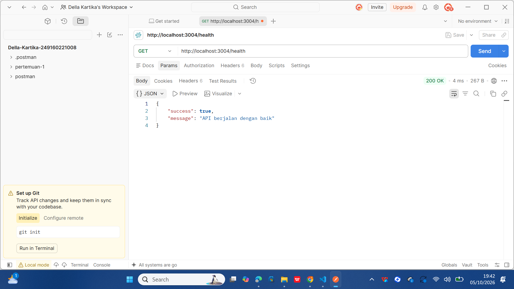
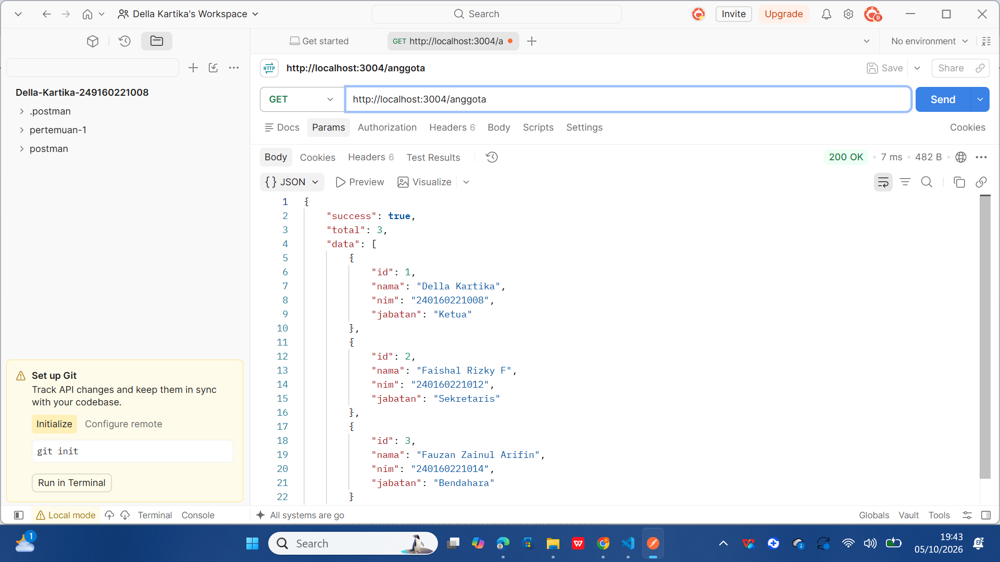
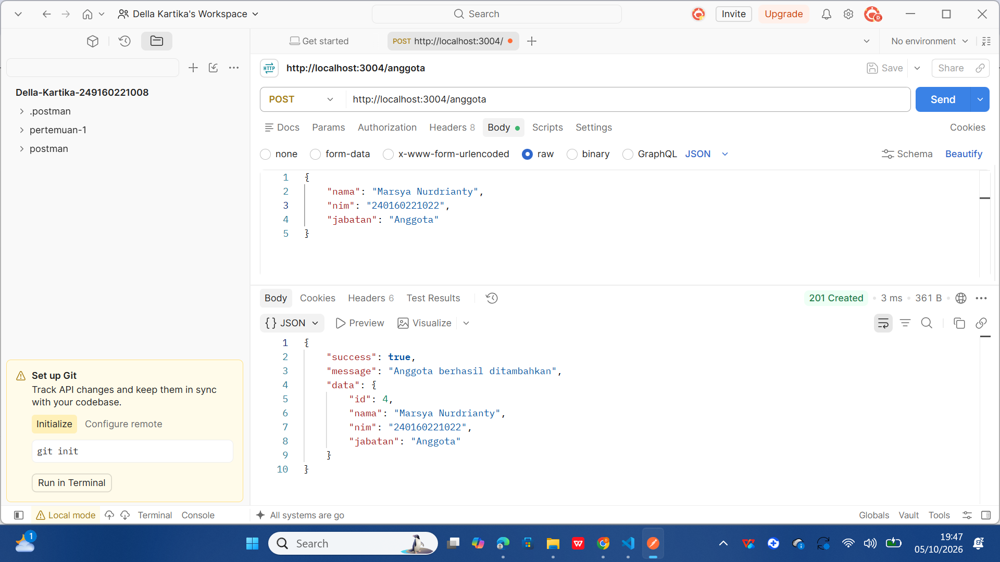
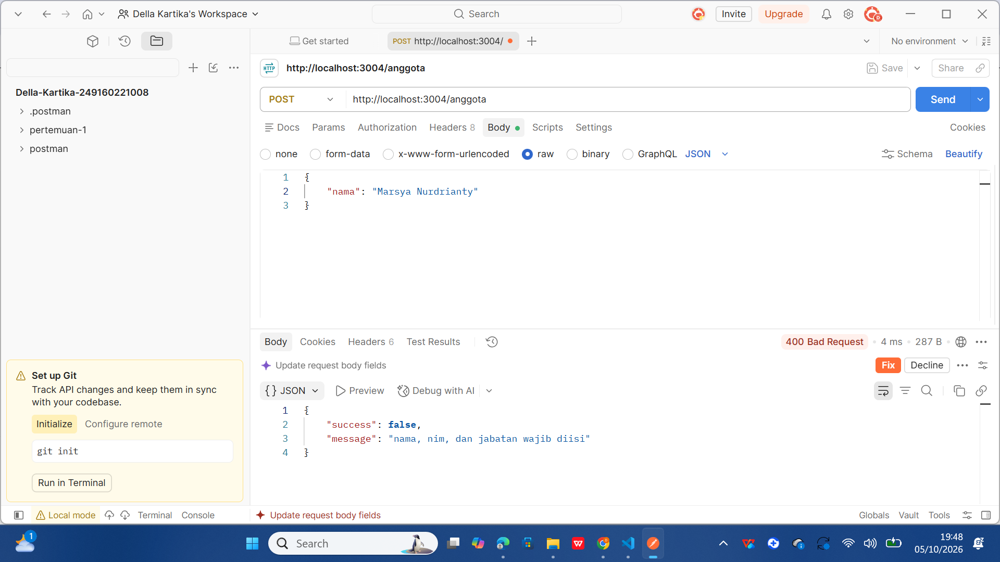
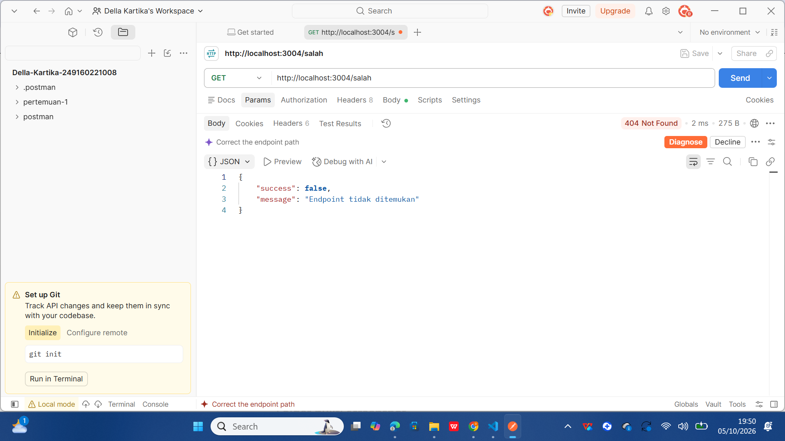

# Tugas 2 — REST Endpoint dengan Express.js

## Identitas

**Nama:** Della Kartika
**NIM:** 240160221008
**Mata Kuliah:** Pemrograman Berbasis Web Back End
**Pertemuan:** 4
**Resource:** Anggota

---

## 1. Deskripsi

Pada tugas ini dibuat sebuah **REST API menggunakan Express.js** dengan resource **Anggota**.

API ini digunakan untuk menampilkan data anggota, mencari anggota berdasarkan ID, melakukan filter berdasarkan jabatan, dan menambahkan data anggota baru.

Fitur yang diterapkan dalam tugas ini yaitu:

* Middleware JSON
* Middleware logger
* Route parameter
* Query parameter
* POST request
* Validasi input
* HTTP status code
* Handler 404
* Error middleware

---

## 2. Teknologi yang Digunakan

* Node.js
* Express.js
* JavaScript
* JSON
* Postman

---

## 3. Struktur Folder

```text
pertemuan-04/
├── app.js
├── server.js
├── package.json
├── package-lock.json
├── README.md
└── screenshot/
    ├── 01-get-root.png
    ├── 02-get-health.png
    ├── 03-get-anggota.png
    ├── 04-query-jabatan.png
    ├── 05-get-detail.png
    ├── 06-get-detail-404.png
    ├── 07-post-anggota.png
    ├── 08-post-validasi.png
    └── 09-endpoint-404.png
```

Folder **screenshot** berisi bukti hasil pengujian API menggunakan Postman.

---

# 4. Cara Menjalankan Project

Masuk ke folder project:

```bash
cd pertemuan-04
```

Install dependency:

```bash
npm install
```

Jalankan server:

```bash
npm start
```

Jika berhasil, akan muncul:

```text
Express API berjalan di http://localhost:3004
```

---

# 5. Endpoint yang Tersedia

| Method | Endpoint                 | Keterangan                         |
| ------ | ------------------------ | ---------------------------------- |
| GET    | `/`                      | Menampilkan informasi API          |
| GET    | `/health`                | Mengecek kondisi API               |
| GET    | `/anggota`               | Menampilkan semua anggota          |
| GET    | `/anggota?jabatan=Ketua` | Filter anggota berdasarkan jabatan |
| GET    | `/anggota/:id`           | Menampilkan detail anggota         |
| POST   | `/anggota`               | Menambahkan anggota                |
| GET    | `/salah`                 | Pengujian endpoint tidak ditemukan |

---

# 6. Pengujian Menggunakan Postman

Pengujian dilakukan menggunakan **Postman**. Setiap endpoint diuji untuk memastikan API memberikan response dan status code yang sesuai.

## 6.1 GET Root

**Request:**

```text
GET http://localhost:3004/
```

**Hasil:** `200 OK`

Endpoint berhasil menampilkan informasi REST API Anggota.

### Bukti Pengujian


---

## 6.2 GET Health

**Request:**

```text
GET http://localhost:3004/health
```

**Hasil:** `200 OK`

Endpoint berhasil menunjukkan bahwa API berjalan dengan baik.

### Bukti Pengujian



---

## 6.3 GET Semua Anggota

**Request:**

```text
GET http://localhost:3004/anggota
```

**Hasil:** `200 OK`

Endpoint berhasil menampilkan seluruh data anggota.

### Bukti Pengujian



---

## 6.4 GET Anggota dengan Query Parameter

**Request:**

```text
GET http://localhost:3004/anggota?jabatan=Ketua
```

Query parameter `jabatan=Ketua` digunakan untuk menampilkan anggota berdasarkan jabatan.

**Hasil:** `200 OK`

### Bukti Pengujian


---

## 6.5 GET Detail Anggota

**Request:**

```text
GET http://localhost:3004/anggota/1
```

Endpoint ini menggunakan **route parameter `:id`** untuk mengambil data anggota berdasarkan ID.

**Hasil:** `200 OK`

### Bukti Pengujian


---

## 6.6 GET Detail dengan ID yang Tidak Ditemukan

**Request:**

```text
GET http://localhost:3004/anggota/99
```

ID `99` tidak terdapat dalam data anggota.

**Hasil:** `404 Not Found`

Response:

```json
{
  "success": false,
  "message": "Anggota tidak ditemukan"
}
```

### Bukti Pengujian


---

## 6.7 POST Menambahkan Anggota

**Request:**

```text
POST http://localhost:3004/anggota
```

Data yang dikirim:

```json
{
  "nama": "Marsya Nurdrianty",
  "nim": "240160221022",
  "jabatan": "Anggota"
}
```

**Hasil:** `201 Created`

Data anggota berhasil ditambahkan.

### Bukti Pengujian



---

## 6.8 POST dengan Data Tidak Lengkap

**Request:**

```text
POST http://localhost:3004/anggota
```

Data yang dikirim hanya:

```json
{
  "nama": "Marsya Nurdrianty"
}
```

Field `nim` dan `jabatan` tidak diisi sehingga validasi dijalankan.

**Hasil:** `400 Bad Request`

Response:

```json
{
  "success": false,
  "message": "nama, nim, dan jabatan wajib diisi"
}
```

### Bukti Pengujian



---

## 6.9 Pengujian Endpoint Tidak Ditemukan

**Request:**

```text
GET http://localhost:3004/salah
```

Endpoint `/salah` tidak tersedia sehingga handler 404 dijalankan.

**Hasil:** `404 Not Found`

Response:

```json
{
  "success": false,
  "message": "Endpoint tidak ditemukan"
}
```

### Bukti Pengujian



---

# 7. Middleware Logger

Middleware logger digunakan untuk mencatat setiap request yang masuk ke server.

Informasi yang dicatat meliputi:

* Waktu request
* HTTP method
* URL

Contoh hasil pada terminal:

```text
[5/10/2026, 19.10.20] GET /anggota
[5/10/2026, 19.11.05] GET /anggota/1
[5/10/2026, 19.12.10] POST /anggota
```

---

# 8. Route Parameter

Route parameter digunakan pada endpoint:

```text
GET /anggota/:id
```

Contoh:

```text
GET /anggota/1
```

Angka `1` merupakan nilai dari parameter `id` yang digunakan untuk mencari anggota tertentu.

---

# 9. Query Parameter

Query parameter digunakan untuk melakukan filter data anggota berdasarkan jabatan.

Contoh:

```text
GET /anggota?jabatan=Ketua
```

API akan menampilkan anggota yang memiliki jabatan **Ketua**.

---

# 10. HTTP Status Code

Status code yang digunakan dalam API:

| Status Code | Keterangan                         |
| ----------- | ---------------------------------- |
| 200         | Request berhasil                   |
| 201         | Data berhasil ditambahkan          |
| 400         | Data yang dikirim tidak lengkap    |
| 404         | Data atau endpoint tidak ditemukan |
| 500         | Terjadi kesalahan pada server      |

---

# 11. Handler 404

Handler 404 digunakan ketika pengguna mengakses endpoint yang tidak tersedia.

Contohnya:

```text
GET /salah
```

API akan memberikan response:

```json
{
  "success": false,
  "message": "Endpoint tidak ditemukan"
}
```

---

# 12. Error Middleware

Error middleware digunakan untuk menangani kesalahan yang terjadi pada server.

Jika terjadi error yang tidak ditangani, API akan memberikan status **500 Internal Server Error** dengan response:

```json
{
  "success": false,
  "message": "Terjadi kesalahan pada server"
}
```

---

# 13. Kesimpulan

Pada tugas ini telah dibuat REST API menggunakan **Express.js** dengan resource **Anggota**.

API sudah menerapkan middleware JSON, logger, route parameter, query parameter, POST, validasi input, status code, handler 404, dan error middleware.

Seluruh endpoint telah diuji menggunakan **Postman**. Bukti hasil pengujian disimpan di dalam folder **screenshot** dan ditampilkan langsung pada README.
