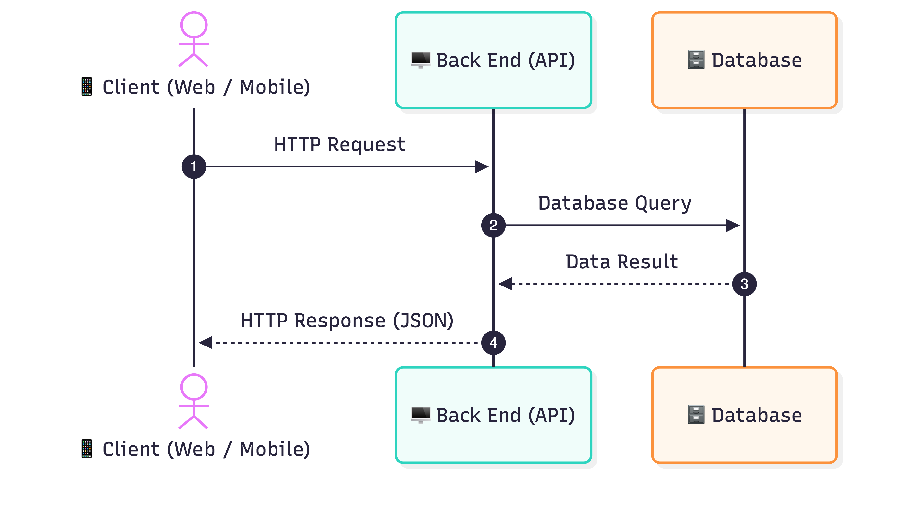

# Tugas 1 — Analisis & Desain API: Personal Library Manager

**Nama:** Faatin Ashri Widiatin  
**NPM:** 240160221011  

---

## 1. Deskripsi Sistem
**Personal Library Manager** adalah sistem informasi berbasis API yang dirancang untuk membantu pemilik koleksi buku pribadi dalam mengelola katalog buku serta mencatat riwayat peminjaman buku oleh teman atau kerabat. Sistem ini digunakan oleh **Pemilik Koleksi (Single User)** sebagai pengelola utama. 

Fitur utamanya mencakup:
* Pencatatan data buku (tambah, lihat detail, perbarui status/kategori, hapus).
* Pencatatan aktivitas peminjaman buku (siapa yang meminjam, tanggal pinjam, tenggat pengembalian, dan status pengembalian).

---

## 2. Diagram Arsitektur API

Berikut adalah diagram alur *Client–Server* komunikasi API pada sistem Personal Library Manager:



### Alur Komunikasi Sistem:
1. **Client** mengirimkan HTTP Request (misal: `GET /buku`) ke Back End API.
2. **Back End API** menerima request, memproses logika bisnis, dan melakukan query ke Database.
3. **Database** mengambil/menyimpan data buku & peminjaman, lalu mengembalikan hasilnya ke Back End API.
4. **Back End API** merespons Client dalam bentuk format data **JSON** beserta HTTP Status Code yang sesuai.

### Komponen Sistem:
| Komponen | Fungsi Utama |
|---|---|
| **Client** | Aplikasi front-end (Web/Mobile/Postman) tempat user berinteraksi. |
| **Back End (API)** | Server pengolah logika bisnis dan penangan request HTTP. |
| **Database** | Media penyimpanan permanen untuk data buku dan riwayat peminjaman. |

> **File Sumber Diagram:** Kode sumber Mermaid tersimpan di file [`diagram.mmd`](diagram.mmd).

---

## 3. Tabel Resource & Endpoint

Dua resource utama yang digunakan: **`buku`** dan **`peminjaman`**.

| No | Operasi | Method | Endpoint | Request Body | Response Body | Sukses | Gagal |
|:--:|:---|:---:|:---|:---:|:---:|:---:|:---:|
| 1 | Ambil semua koleksi buku | `GET` | `/buku` | `-` | Array Data Buku | `200` | `500` |
| 2 | Ambil detail satu buku | `GET` | `/buku/:id` | `-` | Object Data Buku | `200` | `404` |
| 3 | Tambah buku baru | `POST` | `/buku` | Data Buku Baru | Object Buku Terbuat | `201` | `400` |
| 4 | Perbarui data buku utuh | `PUT` | `/buku/:id` | Data Buku Lengkap | Object Buku Terbarui | `200` | `400 / 404` |
| 5 | Hapus buku dari koleksi | `DELETE` | `/buku/:id` | `-` | Pesan Sukses | `200` | `404` |
| 6 | Catat peminjaman buku | `POST` | `/buku/:id/peminjaman` | Data Peminjam | Object Peminjaman | `201` | `400 / 404` |
| 7 | Ambil daftar peminjaman | `GET` | `/peminjaman` | `-` | Array Peminjaman | `200` | `500` |
| 8 | Ubah status pengembalian | `PATCH` | `/peminjaman/:id/kembali` | Tanggal Kembali | Object Peminjaman | `200` | `400 / 404` |

---

## 4. Struktur Data dan Contoh JSON

### A. Resource: `buku`
* **Request Body (`POST /buku`):**
```json
{
  "judul": "Atomic Habits",
  "penulis": "James Clear",
  "kategori": "Self Improvement",
  "tahun_terbit": 2018
}
```

* **Response Body (`201 Created`):**
```json
{
  "success": true,
  "message": "Buku berhasil ditambahkan ke koleksi",
  "data": {
    "id": 101,
    "judul": "Atomic Habits",
    "penulis": "James Clear",
    "kategori": "Self Improvement",
    "tahun_terbit": 2018,
    "status_ketersediaan": true
  }
}
```

### B. Resource: `peminjaman`
* **Request Body (`POST /buku/101/peminjaman`):**
```json
{
  "nama_peminjam": "Budi Santoso",
  "tanggal_pinjam": "2026-09-20",
  "tenggat_kembali": "2026-09-27"
}
```

* **Response Body (`201 Created`):**
```json
{
  "success": true,
  "message": "Peminjaman buku berhasil dicatat",
  "data": {
    "id_peminjaman": "PMJ-001",
    "buku_id": 101,
    "nama_peminjam": "Budi Santoso",
    "tanggal_pinjam": "2026-09-20",
    "tenggat_kembali": "2026-09-27",
    "status": "DIPINJAM"
  }
}
```

---

## 5. HTTP Status Code

Status code digunakan sebagai respons standar untuk memberitahu status hasil pemrosesan request oleh server:

| Status Code | Keterangan | Penggunaan dalam Sistem |
|:---:|:---|:---|
| **200 OK** | Request berhasil diproses | Digunakan pada `GET`, `PUT`, dan `PATCH` yang sukses. |
| **201 Created** | Data/Resource baru berhasil dibuat | Digunakan pada `POST /buku` dan `POST peminjaman` yang sukses. |
| **400 Bad Request** | Format request atau data input tidak valid | Terjadi saat data body JSON tidak lengkap/salah format. |
| **404 Not Found** | Resource yang dicari tidak ditemukan | Terjadi saat mencari ID buku atau ID peminjaman yang tidak ada. |
| **500 Internal Error** | Kesalahan internal pada server/database | Terjadi jika ada gangguan pada koneksi database server. |

---

## 6. Skenario Pengujian

### Skenario 1: Menambahkan Buku Baru (Sukses — 201)
* **Request:** `POST /buku`
* **Header:** `Content-Type: application/json`
* **Body:**
```json
{
  "judul": "Filosofi Teras",
  "penulis": "Henry Manampiring",
  "kategori": "Filsafat",
  "tahun_terbit": 2019
}
```
* **Response Status:** `201 Created`
* **Response Body:**
```json
{
  "success": true,
  "message": "Buku berhasil ditambahkan ke koleksi",
  "data": {
    "id": 102,
    "judul": "Filosofi Teras",
    "penulis": "Henry Manampiring",
    "status_ketersediaan": true
  }
}
```

---

### Skenario 2: Mengambil Detail Buku yang Tidak Ada (Gagal — 404)
* **Request:** `GET /buku/9999`
* **Response Status:** `404 Not Found`
* **Response Body:**
```json
{
  "success": false,
  "message": "Data buku dengan ID 9999 tidak ditemukan"
}
```

---

### Skenario 3: Mencatat Pengembalian Buku (Sukses — 200)
* **Request:** `PATCH /peminjaman/PMJ-001/kembali`
* **Body:**
```json
{
  "tanggal_dikembalikan": "2026-09-25"
}
```
* **Response Status:** `200 OK`
* **Response Body:**
```json
{
  "success": true,
  "message": "Buku telah berhasil dikembalikan",
  "data": {
    "id_peminjaman": "PMJ-001",
    "status": "DIKEMBALIKAN",
    "tanggal_dikembalikan": "2026-09-25"
  }
}
```

---

## 7. Kesimpulan
Perancangan API **Personal Library Manager** ini terdiri dari 2 resource utama (`buku` dan `peminjaman`) dengan total 8 endpoint yang mencakup operasi CRUD dasar hingga manajemen transaksi peminjaman. Rancangan ini telah disesuaikan dengan prinsip standar REST API—seperti penggunaan HTTP Method yang tepat, struktur format data JSON, serta penanganan HTTP Status Code—sehingga siap diimplementasikan ke tahap koding backend.