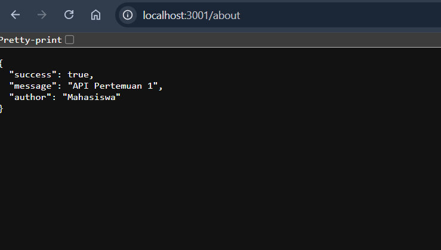
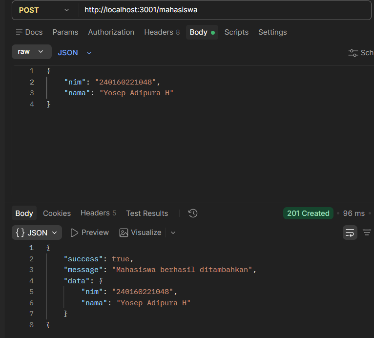
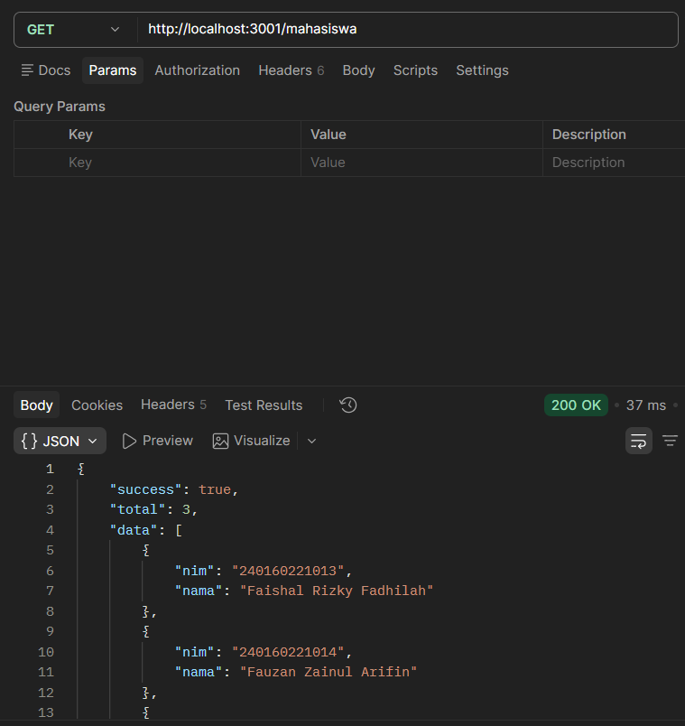
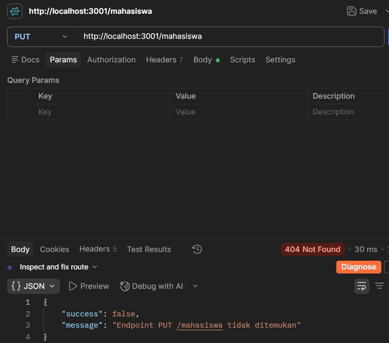
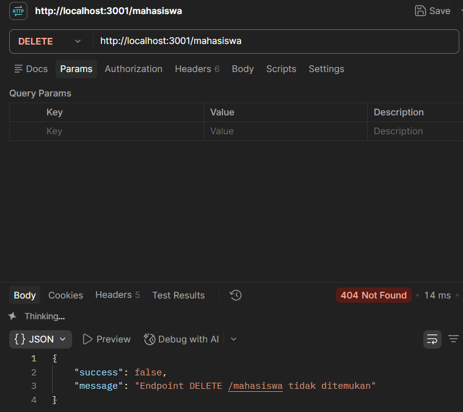
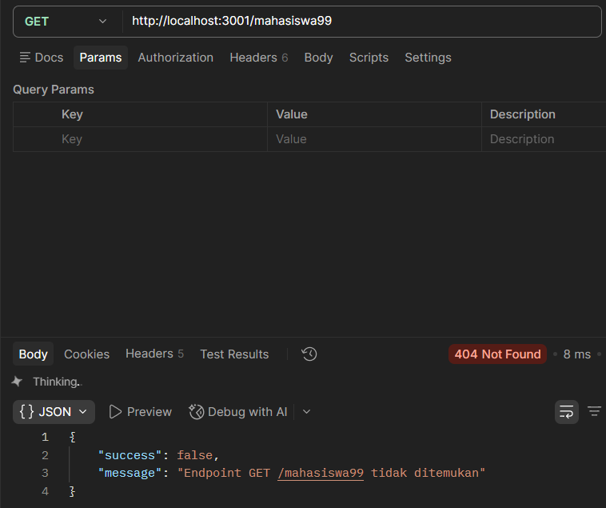

# Dokumentasi Point 18 — Latihan Individu Pertemuan 1

**Nama:** Faishal Rizky Fadhilah
**NIM:** 240160221013
**Mata Kuliah:** Pemrograman Berbasis Web Back End  
**Pertemuan:** 1  
**File program:** `latihan.js`

---

## 1. Tujuan

Latihan ini bertujuan untuk memahami dasar komunikasi **client–server** menggunakan HTTP dan Node.js, meliputi:

- menjalankan server HTTP sederhana menggunakan Node.js;
- memahami HTTP method;
- membuat dan menguji endpoint;
- menerima request body dalam format JSON;
- mengirim response dalam format JSON;
- memahami routing dan status code HTTP;
- melakukan pengujian API menggunakan Postman.

---

## 2. Tools yang Digunakan

- **Visual Studio Code** — untuk membuat dan menjalankan kode.
- **Node.js** — untuk menjalankan server.
- **Postman** — untuk menguji HTTP request dan response.

Server dijalankan pada port:

```text
3001
```

Alamat server:

```text
http://localhost:3001
```

Perintah untuk menjalankan program:

```bash
node latihan.js
```

Jika berhasil, terminal menampilkan:

```text
Latihan berjalan di http://localhost:3001
```

---

## 3. Data Awal

Pada program dibuat array `mahasiswa` yang berisi dua data awal:

```javascript
const mahasiswa = [
    { nim: "240160221013", nama: "Faishal Rizky Fadhilah" },
    { nim: "240160221014", nama: "Fauzan Zainul Arifin" },
];
```

Data tersebut digunakan sebagai data sementara selama server berjalan.

### Catatan

Data yang ditambahkan melalui `POST` disimpan di dalam array selama program berjalan. Karena belum menggunakan database, apabila server dihentikan dengan `Ctrl + C` kemudian dijalankan kembali, data tambahan akan kembali ke data awal.

---

# 4. Implementasi Server

## 4.1 Fungsi `sendJSON()`

Fungsi `sendJSON()` digunakan untuk mengirim response kepada client dalam format JSON.

```javascript
function sendJSON(res, statusCode, payload) {
    res.writeHead(statusCode, { "Content-Type": "application/json" });
    res.end(JSON.stringify(payload, null, 2));
}
```

Fungsi ini menerima tiga parameter:

- `res` — response dari server;
- `statusCode` — status HTTP;
- `payload` — data yang akan dikirim dalam response.

---

## 4.2 Fungsi `readBody()`

Fungsi `readBody()` digunakan untuk membaca data yang dikirim oleh client melalui request body.

```javascript
function readBody(req) {
    return new Promise((resolve) => {
        let body = "";

        req.on("data", (chunk) => {
            body += chunk;
        });

        req.on("end", () => {
            try {
                resolve(body ? JSON.parse(body) : {});
            } catch {
                resolve(null);
            }
        });
    });
}
```

Fungsi ini digunakan pada `POST /mahasiswa` untuk membaca JSON yang dikirim melalui Postman.

---

# 5. Pengujian Endpoint

## 5.1 GET `/about`

### Request

```text
GET http://localhost:3001/about
```

### Tujuan

Menampilkan informasi sederhana mengenai API.

### Response

```json
{
    "success": true,
    "message": "API Pertemuan 1",
    "author": "Mahasiswa"
}
```

### Status

```text
200 OK
```

### Hasil

Endpoint berhasil dijalankan dan menghasilkan response JSON.

**Screenshot hasil pengujian:**



---

## 5.2 POST `/mahasiswa`

### Request

```text
POST http://localhost:3001/mahasiswa
```

Pada Postman digunakan:

```text
Body → raw → JSON
```

Data yang dikirim:

```json
{
    "nim": "240160221048",
    "nama": "Yosep"
}
```

### Proses

Server membaca request body menggunakan `readBody()`, kemudian melakukan validasi terhadap `nim` dan `nama`. Jika data lengkap, data mahasiswa ditambahkan menggunakan `mahasiswa.push()`.

### Response

```json
{
    "success": true,
    "message": "Mahasiswa berhasil ditambahkan",
    "data": {
        "nim": "240160221048",
        "nama": "Yosep"
    }
}
```

### Status

```text
201 Created
```

### Hasil

Data mahasiswa berhasil ditambahkan sehingga jumlah data berubah dari **2 menjadi 3**.

**Screenshot hasil pengujian:**



---

## 5.3 GET `/mahasiswa`

### Request

```text
GET http://localhost:3001/mahasiswa
```

### Tujuan

Menampilkan seluruh data mahasiswa yang tersimpan di dalam array.

### Hasil

Setelah proses `POST`, jumlah data menjadi **3 mahasiswa**.

Contoh response:

```json
{
    "success": true,
    "total": 3,
    "data": [
        {
            "nim": "240160221013",
            "nama": "Faishal Rizky Fadhilah"
        },
        {
            "nim": "240160221014",
            "nama": "Fauzan Zainul Arifin"
        },
        {
            "nim": "240160221048",
            "nama": "Yosep"
        }
    ]
}
```

### Status

```text
200 OK
```

**Screenshot hasil pengujian:**



---

# 6. Prediksi dan Pengujian Method/Endpoint yang Tidak Tersedia

Pada bagian ini dilakukan prediksi terlebih dahulu sebelum request dikirim.

Program hanya mempunyai handler untuk:

```text
GET  /about
POST /mahasiswa
GET  /mahasiswa
```

Tidak terdapat handler khusus untuk:

```text
PUT /mahasiswa
DELETE /mahasiswa/1
GET /mahasiswa/99
```

Karena itu, ketiga request tersebut tidak menjalankan operasi update, delete, atau pencarian berdasarkan ID.

---

## 6.1 PUT `/mahasiswa`

### Prediksi

Request tidak memiliki route `PUT /mahasiswa`, sehingga tidak ada proses update data mahasiswa.

### Request

```text
PUT http://localhost:3001/mahasiswa
```

### Hasil

Server mengembalikan:

```text
404 Not Found
```

Response:

```json
{
    "success": false,
    "message": "Endpoint PUT /mahasiswa tidak ditemukan"
}
```

### Kesimpulan

Prediksi sesuai dengan hasil pengujian. Tidak ada data yang diubah.

**Screenshot hasil pengujian:**



---

## 6.2 DELETE `/mahasiswa/1`

### Prediksi

Request tidak memiliki route `DELETE /mahasiswa/1`, sehingga tidak ada proses penghapusan data.

### Request

```text
DELETE http://localhost:3001/mahasiswa/1
```

### Hasil

Server mengembalikan:

```text
404 Not Found
```

Response:

```json
{
    "success": false,
    "message": "Endpoint DELETE /mahasiswa/1 tidak ditemukan"
}
```

### Kesimpulan

Prediksi sesuai dengan hasil pengujian. Data mahasiswa tidak dihapus.

**Screenshot hasil pengujian:**



---

## 6.3 GET `/mahasiswa/99`

### Prediksi

Program mempunyai endpoint:

```text
GET /mahasiswa
```

tetapi tidak mempunyai endpoint:

```text
GET /mahasiswa/99
```

Karena path tersebut berbeda, request tidak memiliki route yang sesuai.

### Request

```text
GET http://localhost:3001/mahasiswa/99
```

### Hasil

Server mengembalikan:

```text
404 Not Found
```

Response:

```json
{
    "success": false,
    "message": "Endpoint GET /mahasiswa/99 tidak ditemukan"
}
```

### Kesimpulan

Prediksi sesuai dengan hasil pengujian. Data mahasiswa dengan URL tersebut tidak ditemukan karena endpoint-nya memang belum dibuat.

**Screenshot hasil pengujian:**



---

# 7. Ringkasan Hasil Pengujian

| No. | Method | Endpoint | Tujuan | Hasil |
|---:|---|---|---|---|
| 1 | GET | `/about` | Menampilkan informasi API | **200 OK** |
| 2 | POST | `/mahasiswa` | Menambahkan data mahasiswa | **201 Created** |
| 3 | GET | `/mahasiswa` | Menampilkan data mahasiswa | **200 OK**, total 3 |
| 4 | PUT | `/mahasiswa` | Menguji endpoint yang belum tersedia | **404 Not Found** |
| 5 | DELETE | `/mahasiswa/1` | Menguji endpoint yang belum tersedia | **404 Not Found** |
| 6 | GET | `/mahasiswa/99` | Menguji path yang belum tersedia | **404 Not Found** |

---

# 8. Analisis

Dari pengujian yang dilakukan, dapat diketahui bahwa HTTP method dan URL/path merupakan bagian penting dalam routing server. `GET /mahasiswa` dan `GET /mahasiswa/99` tidak dianggap sebagai endpoint yang sama karena memiliki path yang berbeda.

Request `POST /mahasiswa` berhasil menambahkan data baru karena program memiliki handler untuk method `POST` dengan URL `/mahasiswa`. Sebaliknya, `PUT /mahasiswa` dan `DELETE /mahasiswa/1` tidak melakukan perubahan data karena handler untuk kedua method tersebut belum dibuat.

Fallback `404` digunakan untuk memberikan response ketika method atau endpoint yang diminta tidak tersedia. Dengan demikian, client tidak hanya mengetahui bahwa request gagal, tetapi juga mendapatkan informasi bahwa endpoint tersebut tidak ditemukan.

---

# 9. Refleksi

HTTP request adalah pesan yang dikirim oleh client kepada server untuk meminta suatu proses, sedangkan HTTP response merupakan balasan server terhadap request tersebut. Status code penting karena memberikan informasi mengenai hasil request, misalnya `200` untuk request yang berhasil, `201` untuk data yang berhasil dibuat, dan `404` untuk endpoint yang tidak ditemukan. Dari latihan ini saya memahami hubungan antara method, endpoint, request body, response, dan status code dalam komunikasi antara client dan back end.

---

# 10. Kesimpulan

Point 18 telah diselesaikan dengan membuat dan menjalankan server HTTP sederhana menggunakan Node.js serta melakukan pengujian menggunakan Postman.

Endpoint yang berhasil dibuat dan diuji adalah:

```text
GET  /about
POST /mahasiswa
GET  /mahasiswa
```

Selain itu dilakukan prediksi dan pengujian terhadap:

```text
PUT    /mahasiswa
DELETE /mahasiswa/1
GET    /mahasiswa/99
```

Ketiga request tersebut menghasilkan `404 Not Found` karena tidak memiliki route yang sesuai. Melalui latihan ini dapat dipahami dasar routing, HTTP method, request body, response JSON, dan status code pada back end.

---

# 11. Checklist Point 18

- [x] Membuat dan menjalankan server Node.js
- [x] Menggunakan port `3001`
- [x] Membuat fungsi `sendJSON()`
- [x] Membuat fungsi `readBody()`
- [x] Menguji `GET /about`
- [x] Menguji `POST /mahasiswa`
- [x] Menambahkan data mahasiswa
- [x] Menguji `GET /mahasiswa`
- [x] Memastikan jumlah data menjadi 3
- [x] Memprediksi hasil `PUT /mahasiswa`
- [x] Menguji `PUT /mahasiswa`
- [x] Memprediksi hasil `DELETE /mahasiswa/1`
- [x] Menguji `DELETE /mahasiswa/1`
- [x] Memprediksi hasil `GET /mahasiswa/99`
- [x] Menguji `GET /mahasiswa/99`
- [x] Memahami response `404 Not Found`
- [x] Membuat refleksi
- [x] Menambahkan screenshot hasil pengujian ke dokumentasi
- [x] Menyimpan dokumentasi bersama file tugas sesuai ketentuan pengumpulan
