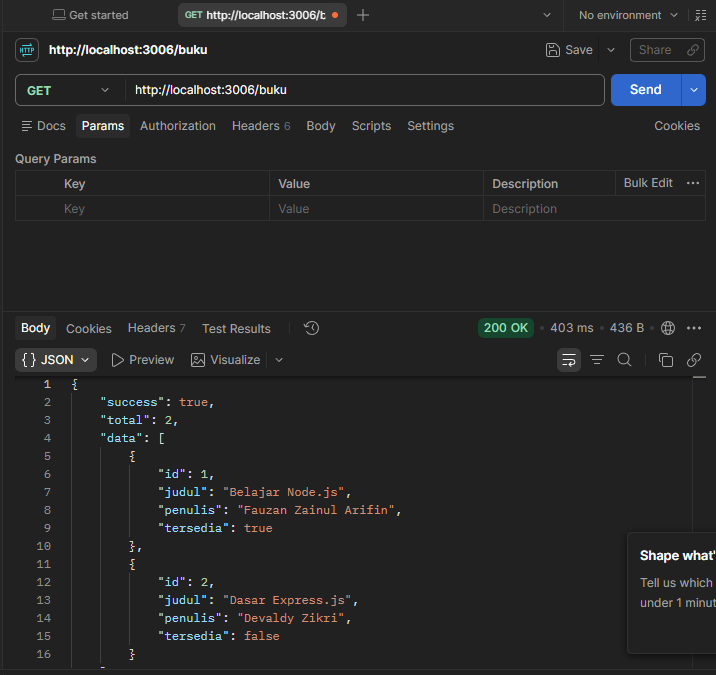
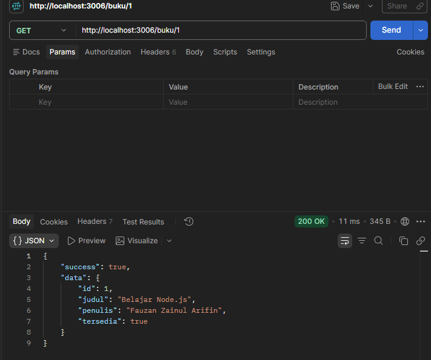
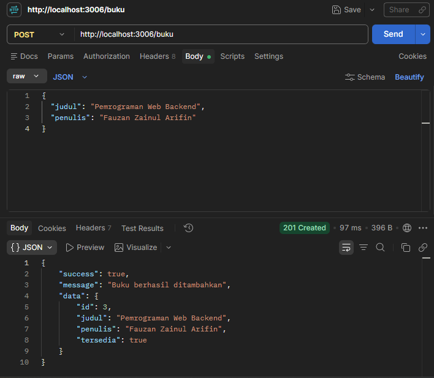
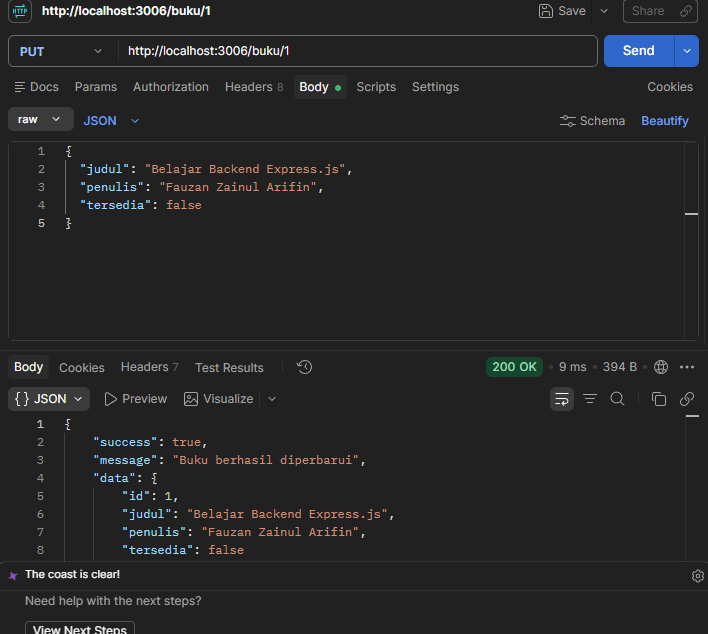
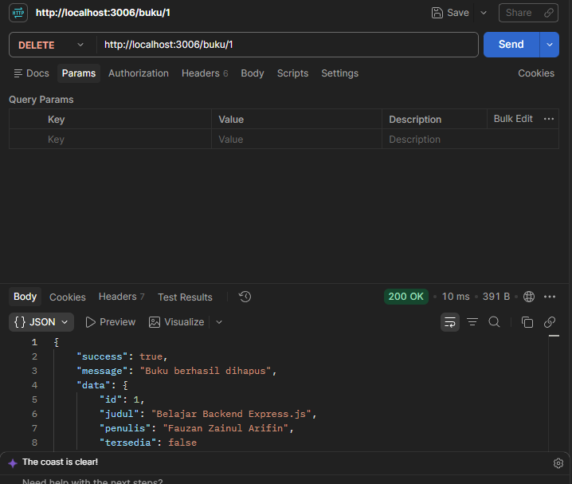
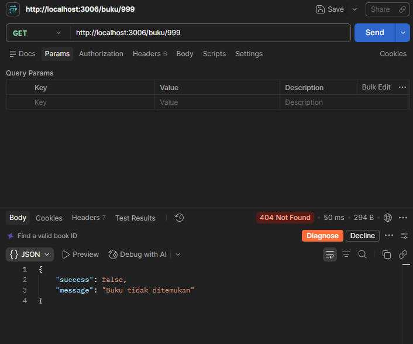
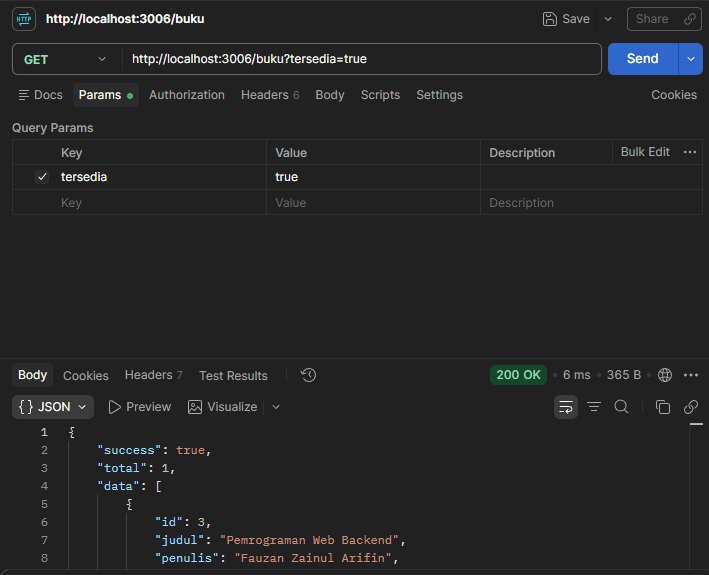
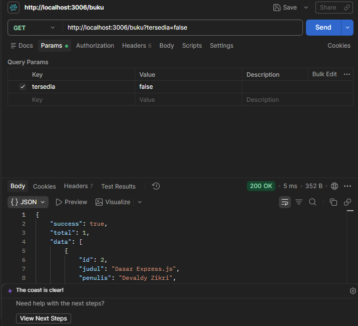
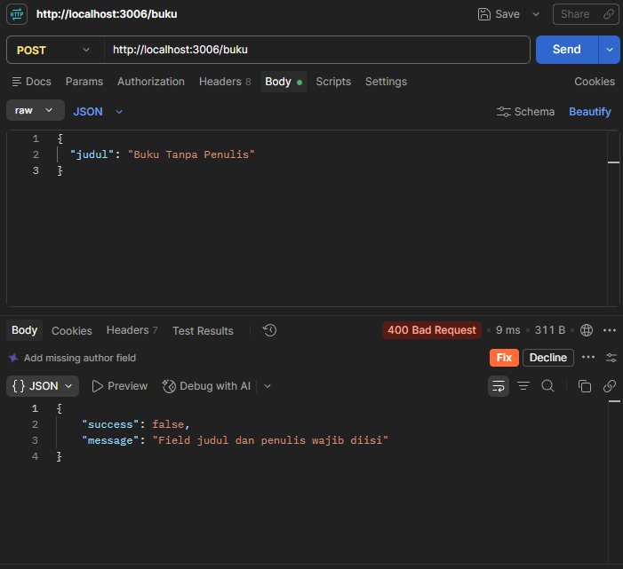
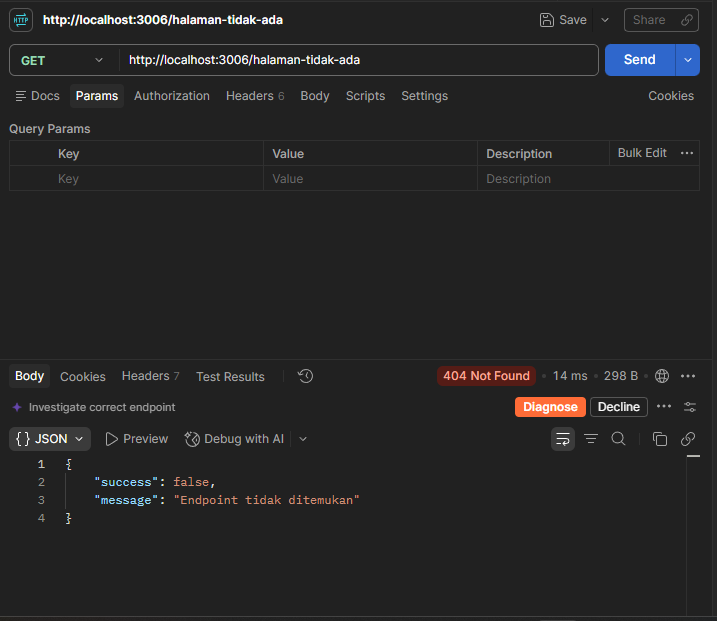

# Tugas 2 — REST API Perpustakaan dengan Express.js

**Nama:** Fauzan Zainul Arifin  
**NIM:** 240160221014  
**Mata Kuliah:** SI-VA Backend  
**Pertemuan:** 4  
**Port:** `3006`

---

## 1. Deskripsi

Project ini merupakan aplikasi REST API sederhana untuk resource **Buku/Perpustakaan** yang dibuat menggunakan **Node.js dan Express.js**.

Aplikasi menerapkan konsep dasar REST API, meliputi:

- GET daftar buku
- GET detail buku berdasarkan ID
- POST menambahkan buku
- PUT memperbarui buku
- DELETE menghapus buku
- Query parameter untuk filter ketersediaan
- Route parameter untuk ID buku
- Middleware JSON
- Middleware logger
- Validasi input
- Handler 404
- Error middleware
- Response JSON dengan HTTP status code yang sesuai

Data masih disimpan di dalam array sehingga belum menggunakan database.

---

## 2. Tujuan Pembelajaran

Setelah menyelesaikan tugas ini, diharapkan dapat:

1. Membuat aplikasi REST API menggunakan Express.js.
2. Memisahkan aplikasi menjadi `app.js` dan `server.js`.
3. Membuat routing berdasarkan method HTTP.
4. Menggunakan route parameter dan query parameter.
5. Menggunakan middleware pada Express.js.
6. Membuat response JSON dengan status code yang tepat.
7. Menangani endpoint yang tidak ditemukan.
8. Membuat validasi request.
9. Menguji REST API menggunakan Postman.

---

## 3. Teknologi

- **Node.js**
- **Express.js**
- **npm**
- **Postman**
- **JSON**

---

## 4. Struktur Project

```text
Tugas-2/
├── app.js
├── server.js
├── package.json
├── package-lock.json
├── README.md
└── screenshots/
    ├── 01-get-daftar-buku.png
    ├── 02-get-detail-buku.png
    ├── 03-post-tambah-buku.png
    ├── 04-put-ubah-buku.png
    ├── 05-delete-buku.png
    ├── 06-get-buku-404.png
    ├── 07-filter-tersedia-true.png
    ├── 08-filter-tersedia-false.png
    ├── 09-post-validasi-400.png
    └── 10-endpoint-404.png
```

> **Catatan:** Nama file gambar di atas harus disamakan dengan nama screenshot yang sebenarnya kamu simpan.

---

## 5. Fungsi File

| File | Fungsi |
|---|---|
| `app.js` | Konfigurasi Express, middleware, data buku, route, handler 404, dan error middleware. |
| `server.js` | Menjalankan aplikasi Express pada port `3006`. |
| `package.json` | Informasi project, script, dan dependency. |
| `package-lock.json` | Mencatat dependency dan versi paket yang terpasang. |
| `README.md` | Dokumentasi project dan hasil pengujian. |
| `screenshots/` | Menyimpan bukti hasil pengujian Postman. |

---

## 6. Instalasi

Pastikan Node.js dan npm sudah terpasang.

Masuk ke folder:

```bash
cd Pertemuan-4/Tugas-2
```

Install dependency:

```bash
npm install
```

Jika berhasil, dependency Express akan terpasang.

---

## 7. Menjalankan Server

Jalankan:

```bash
npm start
```

Output:

```text
Server berjalan di http://localhost:3006
Tekan Ctrl + C untuk menghentikan server.
```

Server berjalan pada:

```text
http://localhost:3006
```

Selama melakukan pengujian menggunakan Postman, terminal harus tetap menjalankan server.

---

# 8. Daftar Endpoint

| No | Method | Endpoint | Keterangan |
|---:|---|---|---|
| 1 | GET | `/buku` | Menampilkan seluruh buku |
| 2 | GET | `/buku/:id` | Menampilkan detail buku |
| 3 | POST | `/buku` | Menambahkan buku |
| 4 | PUT | `/buku/:id` | Mengubah data buku |
| 5 | DELETE | `/buku/:id` | Menghapus buku |
| 6 | GET | `/buku?tersedia=true` | Filter buku tersedia |
| 7 | GET | `/buku?tersedia=false` | Filter buku tidak tersedia |

---

# 9. Route Parameter

Route parameter digunakan untuk mengambil ID buku.

Contoh:

```http
GET /buku/1
```

Angka `1` merupakan parameter `id`.

Contoh endpoint:

```text
/buku/:id
```

---

# 10. Query Parameter

Query parameter digunakan untuk melakukan filter berdasarkan ketersediaan buku.

### Buku tersedia

```http
GET /buku?tersedia=true
```

### Buku tidak tersedia

```http
GET /buku?tersedia=false
```

Jika parameter `tersedia` tidak digunakan:

```http
GET /buku
```

maka seluruh buku ditampilkan.

---

# 11. Contoh Request dan Response

## 11.1 GET — Daftar Buku

### Request

```http
GET http://localhost:3006/buku
```

### Contoh Response

```json
{
  "success": true,
  "total": 2,
  "data": [
    {
      "id": 1,
      "judul": "Belajar Node.js",
      "penulis": "Sata",
      "tersedia": true
    },
    {
      "id": 2,
      "judul": "Dasar Express.js",
      "penulis": "Devaldy",
      "tersedia": false
    }
  ]
}
```

Status:

```text
200 OK
```

### Bukti Pengujian



---

## 11.2 GET — Detail Buku

### Request

```http
GET http://localhost:3006/buku/1
```

### Contoh Response

```json
{
  "success": true,
  "data": {
    "id": 1,
    "judul": "Belajar Node.js",
    "penulis": "Sata",
    "tersedia": true
  }
}
```

Status:

```text
200 OK
```

### Bukti Pengujian



---

## 11.3 POST — Menambahkan Buku

### Request

```http
POST http://localhost:3006/buku
```

Header:

```text
Content-Type: application/json
```

Body:

```json
{
  "judul": "Belajar Backend",
  "penulis": "Fauzan Zainul Arifin"
}
```

### Contoh Response

```json
{
  "success": true,
  "message": "Buku berhasil ditambahkan",
  "data": {
    "id": 3,
    "judul": "Belajar Backend",
    "penulis": "Fauzan Zainul Arifin",
    "tersedia": true
  }
}
```

Status:

```text
201 Created
```

### Bukti Pengujian



---

## 11.4 PUT — Mengubah Buku

### Request

```http
PUT http://localhost:3006/buku/1
```

Header:

```text
Content-Type: application/json
```

Contoh body:

```json
{
  "judul": "Belajar Backend Express.js",
  "penulis": "Fauzan Zainul Arifin",
  "tersedia": false
}
```

Status berhasil:

```text
200 OK
```

### Bukti Pengujian



---

## 11.5 DELETE — Menghapus Buku

### Request

```http
DELETE http://localhost:3006/buku/1
```

Status berhasil:

```text
200 OK
```

### Bukti Pengujian



---

# 12. Pengujian Error dan Validasi

## 12.1 GET Buku yang Tidak Ditemukan

### Request

```http
GET http://localhost:3006/buku/999
```

### Response

```json
{
  "success": false,
  "message": "Buku tidak ditemukan"
}
```

Status:

```text
404 Not Found
```

### Bukti Pengujian



---

## 12.2 Filter Buku Tersedia

### Request

```http
GET http://localhost:3006/buku?tersedia=true
```

Hasil hanya menampilkan buku dengan:

```json
"tersedia": true
```

Status:

```text
200 OK
```

### Bukti Pengujian



---

## 12.3 Filter Buku Tidak Tersedia

### Request

```http
GET http://localhost:3006/buku?tersedia=false
```

Hasil hanya menampilkan buku dengan:

```json
"tersedia": false
```

Status:

```text
200 OK
```

### Bukti Pengujian



---

## 12.4 Validasi POST

Request tanpa field `penulis`:

```http
POST http://localhost:3006/buku
```

Body:

```json
{
  "judul": "Buku Tanpa Penulis"
}
```

Response:

```json
{
  "success": false,
  "message": "Field judul dan penulis wajib diisi"
}
```

Status:

```text
400 Bad Request
```

### Bukti Pengujian



---

## 12.5 Endpoint Tidak Ditemukan

### Request

```http
GET http://localhost:3006/halaman-tidak-ada
```

### Response

```json
{
  "success": false,
  "message": "Endpoint tidak ditemukan"
}
```

Status:

```text
404 Not Found
```

### Bukti Pengujian



---

# 13. Middleware

## 13.1 Middleware JSON

Aplikasi menggunakan:

```javascript
app.use(express.json());
```

Middleware ini digunakan untuk membaca request body dalam format JSON.

Contohnya digunakan pada endpoint POST dan PUT.

---

## 13.2 Middleware Logger

Aplikasi juga memiliki middleware logger yang mencatat:

- tanggal/waktu request
- HTTP method
- URL endpoint

Contoh output terminal:

```text
[5/10/2026, 13.43.30] POST /buku
```

Middleware ini membantu melihat aktivitas request yang masuk ke server.

---

# 14. Handler 404

Aplikasi menyediakan handler khusus untuk endpoint yang tidak ditemukan.

Contoh:

```http
GET /halaman-tidak-ada
```

Response:

```json
{
  "success": false,
  "message": "Endpoint tidak ditemukan"
}
```

Status:

```text
404 Not Found
```

---

# 15. Error Middleware

Aplikasi menggunakan error middleware Express untuk menangani error yang terjadi selama proses request.

Secara umum middleware error Express menggunakan empat parameter:

```javascript
(error, req, res, next)
```

Jika terjadi error yang diteruskan ke middleware tersebut, aplikasi dapat memberikan response JSON dengan status:

```text
500 Internal Server Error
```

---

# 16. Hasil Pengujian

| No | Skenario | Method | Status | Hasil |
|---:|---|---|---|---|
| 1 | Menampilkan daftar buku | GET | `200 OK` | Berhasil |
| 2 | Menampilkan detail buku | GET | `200 OK` | Berhasil |
| 3 | Menambahkan buku | POST | `201 Created` | Berhasil |
| 4 | Mengubah data buku | PUT | `200 OK` | Berhasil |
| 5 | Menghapus buku | DELETE | `200 OK` | Berhasil |
| 6 | Mencari ID buku yang tidak ada | GET | `404 Not Found` | Berhasil |
| 7 | Filter buku tersedia | GET | `200 OK` | Berhasil |
| 8 | Filter buku tidak tersedia | GET | `200 OK` | Berhasil |
| 9 | Validasi data POST | POST | `400 Bad Request` | Berhasil |
| 10 | Endpoint tidak ditemukan | GET | `404 Not Found` | Berhasil |

---

# 17. Bukti Screenshot Pengujian

Dokumentasi pengujian disimpan pada folder:

```text
screenshots/
```

Daftar screenshot:

1. `01-get-daftar-buku.png`
2. `02-get-detail-buku.png`
3. `03-post-tambah-buku.png`
4. `04-put-ubah-buku.png`
5. `05-delete-buku.png`
6. `06-get-buku-404.png`
7. `07-filter-tersedia-true.png`
8. `08-filter-tersedia-false.png`
9. `09-post-validasi-400.png`
10. `10-endpoint-404.png`

Jika nama screenshot yang digunakan berbeda, ubah nama pada bagian Markdown agar sesuai.

---

# 18. Catatan

Aplikasi ini menggunakan penyimpanan data berupa array di dalam program.

Artinya:

- Tidak menggunakan database.
- Data hanya tersimpan selama server berjalan.
- Data dapat kembali ke kondisi awal setelah server dihentikan dan dijalankan kembali.
- Project berfokus pada penerapan REST API menggunakan Express.js.

---

# 19. Kesimpulan

Pada Tugas 2 ini telah dibuat REST API sederhana menggunakan Express.js untuk resource buku/perpustakaan.

Aplikasi telah menerapkan:

- `GET` daftar data.
- `GET` detail data.
- `POST` data.
- `PUT` data.
- `DELETE` data.
- Route parameter.
- Query parameter.
- Middleware JSON.
- Middleware logger.
- Validasi input.
- HTTP status code.
- Handler 404.
- Error middleware.
- Pengujian menggunakan Postman.

Dengan demikian, project memenuhi kebutuhan dasar pembuatan REST endpoint menggunakan Express.js pada Pertemuan 4.
